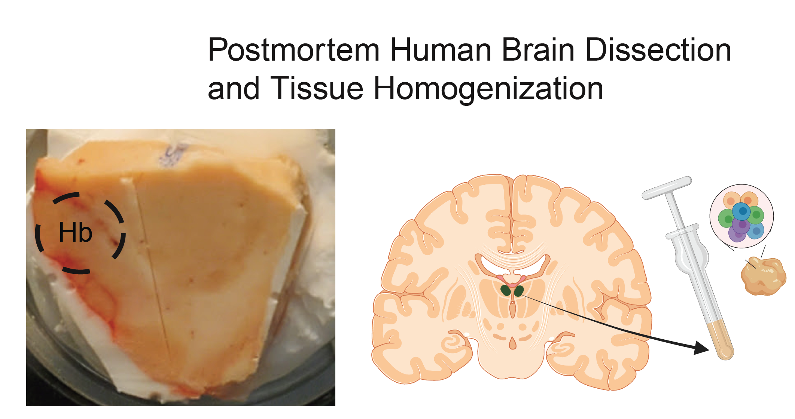

# Habenula_Pilot

[](https://zenodo.org/doi/10.5281/zenodo.10525874)



# Project overview

This project involves bulk RNA-seq data from the habenula of 69 donors with both cases and controls for schizophrenia risk disorder. Additionally, we generated single nucleus RNA-seq (snRNA-seq) data from a subset 7 control donors. Finally, we performed multiplexed single-molecule fluorescence in situ hybridization (smFISH) experiments. These smFISH experiments were analyzed with [_HALO_](https://indicalab.com/halo/).

# Citation

We hope that this repository will be useful for your research. Please use the following [BibTeX](https://en.wikipedia.org/wiki/BibTeX) information to cite this code repository as well as the data released by this project. Thank you!

> **Transcriptomic analysis of the human habenula in schizophrenia**

> Ege A. Yalcinbas, Bukola Ajanaku, Erik D. Nelson, Renee Garcia-Flores, Kelsey D. Montgomery, Joshua M. Stolz, Joshua Wu, Heena R. Divecha, Atharv Chandra, Rahul Bharadwaj, Svitlana Bach, Anandita Rajpurohit, Ran Tao, Joo-Heon Shin, Joel E. Kleinman, Thomas M. Hyde, Louise A. Huuki-Myers, Leonardo Collado-Torres, Kristen R. Maynard.

> bioRxiv (TODO DOI); doi: <https://doi.org/10.1101/TODO>

```
@article {TODO (once we have a pre-print)
}
```

# Data access

Files for this project are publicly available, either directly here or via controlled-access locations when necessary.

## snRNA-seq

The FASTQ files are available via Globus endpoint ['jhpce#habenulaPilotsnRNAseq'](https://research.libd.org/globus/jhpce_habenulaPilotsnRNAseq/index.html) endpoint.

## bulk RNA-seq

The RNA-seq FASTQ files are available via Globus endpoint ['jhpce#habenulaPilotbulkRNAseq'](https://research.libd.org/globus/jhpce_habenulaPilotbulkRNAseq/index.html) endpoint. The DNA genotype data is available via ['jhpce#habenulaPilotbulkDNAgenotype'](https://research.libd.org/globus/jhpce_habenulaPilotbulkDNAgenotype/index.html), however access to it is granted upon request given the protected nature of this data.

## smFISH data

The RNAscope images are available via the Globus endpoint ['jhpce#habenulaPilotRNAscope'](https://research.libd.org/globus/jhpce_habenulaPilotRNAscope/index.html). (TODO by Louise: describe settings files + the output files from HALO. You might want to put them all as a sub-directory of `/dcs04/lieber/lcolladotor/pilotHb_LIBD001/Roche_Habenula/raw-data/RNAscope_images` so it's all part of the same Globus endpoint)

# Code structure

Files are in general organized following the structure from [LieberInstitute/template_project](https://github.com/LieberInstitute/template_project). Log files include the corresponding R session information with details about version numbers of the packages we used.

## Code Organization

Please note that each folder has an internal `README.md` file for clarity.

* [01_bulk_speaqeasy](https://github.com/LieberInstitute/Habenula_Bulk/tree/master/code/01_bulk_speaqeasy) - bulk FASTQ files     
* [07_cellranger](https://github.com/LieberInstitute/Habenula_Bulk/tree/master/code/07_cellranger) - snRNA-seq transcriptomics data (only folder majorly out of order*)    
* [02_bulk_qc](https://github.com/LieberInstitute/Habenula_Bulk/tree/master/code/02_bulk_qc) - bulk RNA-seq QC information     
* [03_bulk_pca](https://github.com/LieberInstitute/Habenula_Bulk/tree/master/code/03_bulk_pca) - ran PCA on filtered bulk data and investigated trends    
* [04_snRNA-seq](https://github.com/LieberInstitute/Habenula_Bulk/tree/master/code/04_snRNA-seq) - snRNA-seq full QC, PCA, harmonization, clustering, and annotation steps  
* [05_explore_sce](https://github.com/LieberInstitute/Habenula_Bulk/tree/master/code/05_explore_sce) - process of correcting snRNA-seq annotations, finalizing identities of clusters, and collecting gene marker information.    
* [06_deconvolution](https://github.com/LieberInstitute/Habenula_Bulk/tree/master/code/06_deconvolution) - process of bulk deconvolution  
* [09_trans_special_analysis](https://github.com/LieberInstitute/Habenula_Bulk/tree/master/code/09_trans_special_analysis) - journey of performing trans-special analyses on snRNA habenula cluster data.   
* [10_DEA](https://github.com/LieberInstitute/Habenula_Bulk/tree/master/code/10_DEA) - bulk RNA-seq differential expression analysis  
* [99_paper_figs](https://github.com/LieberInstitute/Habenula_Bulk/tree/master/code/99_paper_figs) - code used for several snRNA-seq paper figures including relevant bulk deconvolution plots. 

# Internal

JHPCE location: `/dcs04/lieber/lcolladotor/pilotHb_LIBD001/Roche_Habenula`
