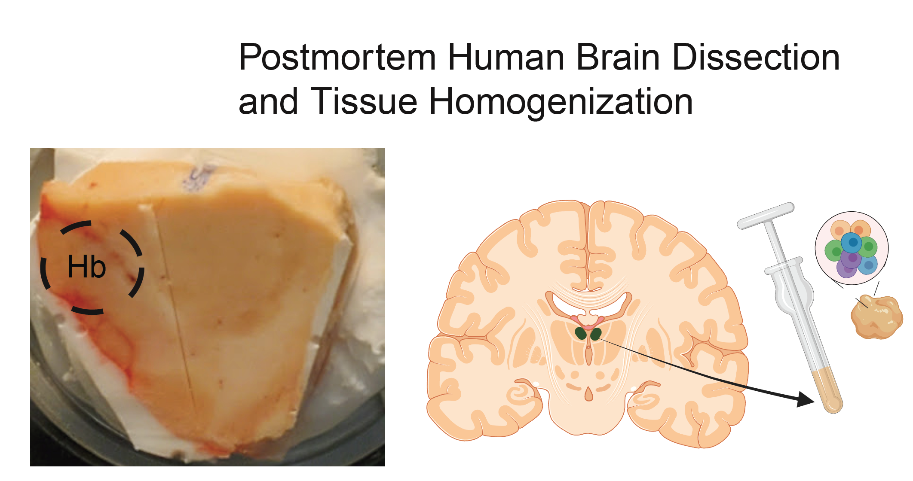

# Habenula_Pilot

[](https://zenodo.org/doi/10.5281/zenodo.10525874)



# Project overview

This project involves bulk RNA-seq data from the habenula of 69 donors with both cases and controls for schizophrenia risk disorder. Additionally, we generated single nucleus RNA-seq (snRNA-seq) data from a subset 7 control donors. Finally, we performed multiplexed single-molecule fluorescence in situ hybridization (smFISH) experiments. These smFISH experiments were analyzed with [_HALO_](https://indicalab.com/halo/).

# Citation

We hope that this repository will be useful for your research. Please use the following [BibTeX](https://en.wikipedia.org/wiki/BibTeX) information to cite this code repository as well as the data released by this project. Thank you!

> Yalcinbas EA, Ajanaku B, Nelson ED, Garcia-Flores R, Eagles NJ, Montgomery KD, Stolz JM, Wu J, Divecha HR, Chandra A, Bharadwaj RA, Bach SV, Rajpurohit A, Tao R, Pertea G, Shin JH, Kleinman JE, Hyde TM, Weinberger DR, Huuki-Myers LA, Collado-Torres L, Maynard KR. Transcriptomic Analysis of the Human Habenula in Schizophrenia. Am J Psychiatry. 2025 Nov 1;182(11):991-1006. doi: [10.1176/appi.ajp.20240776](https://doi.org/10.1176/appi.ajp.20240776). PubMed PMID: [41174894](https://www.ncbi.nlm.nih.gov/pubmed/41174894/).


```
@article{yalcinbas_transcriptomic_2025,
	title = {Transcriptomic {Analysis} of the {Human} {Habenula} in {Schizophrenia}},
	volume = {182},
	issn = {0002-953X},
	url = {https://psychiatryonline.org/doi/10.1176/appi.ajp.20240776},
	doi = {10.1176/appi.ajp.20240776},
	number = {11},
	urldate = {2025-11-03},
	journal = {American Journal of Psychiatry},
	publisher = {American Psychiatric Publishing},
	author = {Yalcinbas, Ege A. and Ajanaku, Bukola and Nelson, Erik D. and Garcia-Flores, Renee and Eagles, Nicholas J. and Montgomery, Kelsey D. and Stolz, Joshua M. and Wu, Joshua and Divecha, Heena R. and Chandra, Atharv and Bharadwaj, Rahul A. and Bach, Svitlana V. and Rajpurohit, Anandita and Tao, Ran and Pertea, Geo and Shin, Joo-Heon and Kleinman, Joel E. and Hyde, Thomas M. and Weinberger, Daniel R. and Huuki-Myers, Louise A. and Collado-Torres, Leonardo and Maynard, Kristen R.},
	month = nov,
	year = {2025},
	pages = {991--1006}
}
```

# Interactive websites

Using [`iSEE`](https://bioconductor.org/packages/iSEE/) we have two interactive websites which you can use to explore the gene expression data.

* bulk RNA-seq: https://libd.shinyapps.io/habenulaPilot_bulk/
* snRNA-seq: https://libd.shinyapps.io/habenulaPilot_snRNAseq/

# Data access

Files for this project are publicly available, either directly here or via controlled-access locations when necessary.

## snRNA-seq

The FASTQ files are available via Globus endpoint ['jhpce#habenulaPilotsnRNAseq'](https://research.libd.org/globus/jhpce_habenulaPilotsnRNAseq/index.html) endpoint.

Main sce object for snRNA-seq data `processed-data/sce_objects/sce_Habenula_Pilot.Rdata` (Too large for Github).
Also Available via Globus endpoint ['jhpce#habenulaPilotsnRNAseq'](https://research.libd.org/globus/jhpce_habenulaPilotsnRNAseq/index.html).

## bulk RNA-seq

The RNA-seq FASTQ files are available via Globus endpoint ['jhpce#habenulaPilotbulkRNAseq'](https://research.libd.org/globus/jhpce_habenulaPilotbulkRNAseq/index.html) endpoint. The DNA genotype data is available via ['jhpce#habenulaPilotbulkDNAgenotype'](https://research.libd.org/globus/jhpce_habenulaPilotbulkDNAgenotype/index.html), however access to it is granted upon request given the protected nature of this data.

Main rse object for bulk RNA-seq data [`rse_objects/rse_gene_Habenula_Pilot.rda`](https://github.com/LieberInstitute/Habenula_Pilot/blob/master/processed-data/rse_objects/rse_gene_Habenula_Pilot.rda).

## smFISH data

The RNAscope images are available via the Globus endpoint ['jhpce#habenulaPilotRNAscope'](https://research.libd.org/globus/jhpce_habenulaPilotRNAscope/index.html).

These images were analyzed with HALO software (Indica labs), settings files & tabular output of the HALO analysis are available in [`processed-data/14_RNAscope/HALO_data`](https://github.com/LieberInstitute/Habenula_Pilot/tree/master/processed-data/14_RNAscope/HALO_data).

# Code structure

Files are in general organized following the structure from [LieberInstitute/template_project](https://github.com/LieberInstitute/template_project). Log files include the corresponding R session information with details about version numbers of the packages we used.

## Code Organization

Please note that each folder has an internal `README.md` file for clarity.

* [01_bulk_speaqeasy](https://github.com/LieberInstitute/Habenula_Bulk/tree/master/code/01_bulk_speaqeasy) - bulk FASTQ files     
* [07_cellranger](https://github.com/LieberInstitute/Habenula_Bulk/tree/master/code/07_cellranger) - snRNA-seq transcriptomics data (only folder majorly out of order*)    
* [02_bulk_qc](https://github.com/LieberInstitute/Habenula_Bulk/tree/master/code/02_bulk_qc) - bulk RNA-seq QC information     
* [03_bulk_pca](https://github.com/LieberInstitute/Habenula_Bulk/tree/master/code/03_bulk_pca) - ran PCA on filtered bulk data and investigated trends    
* [04_snRNA-seq](https://github.com/LieberInstitute/Habenula_Bulk/tree/master/code/04_snRNA-seq) - snRNA-seq full QC, PCA, harmonization, clustering, and annotation steps  
* [05_explore_sce](https://github.com/LieberInstitute/Habenula_Bulk/tree/master/code/05_explore_sce) - process of correcting snRNA-seq annotations, finalizing identities of clusters, and collecting gene marker information.    
* [06_deconvolution](https://github.com/LieberInstitute/Habenula_Bulk/tree/master/code/06_deconvolution) - process of bulk deconvolution  
* [09_trans_special_analysis](https://github.com/LieberInstitute/Habenula_Bulk/tree/master/code/09_trans_special_analysis) - journey of performing trans-special analyses on snRNA habenula cluster data.   
* [10_DEA](https://github.com/LieberInstitute/Habenula_Bulk/tree/master/code/10_DEA) - bulk RNA-seq differential expression analysis  
* [99_paper_figs](https://github.com/LieberInstitute/Habenula_Bulk/tree/master/code/99_paper_figs) - code used for several snRNA-seq paper figures including relevant bulk deconvolution plots. 

# Internal

JHPCE location: `/dcs04/lieber/lcolladotor/pilotHb_LIBD001/Roche_Habenula`
